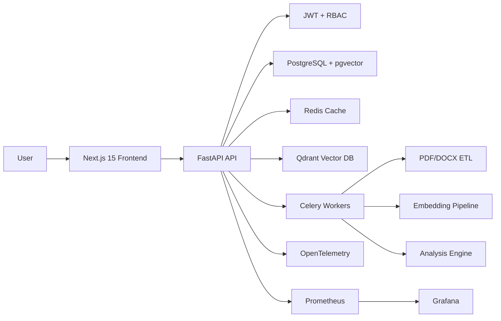
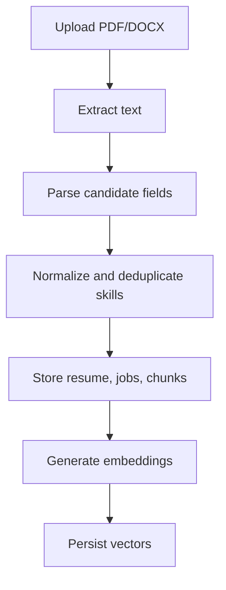
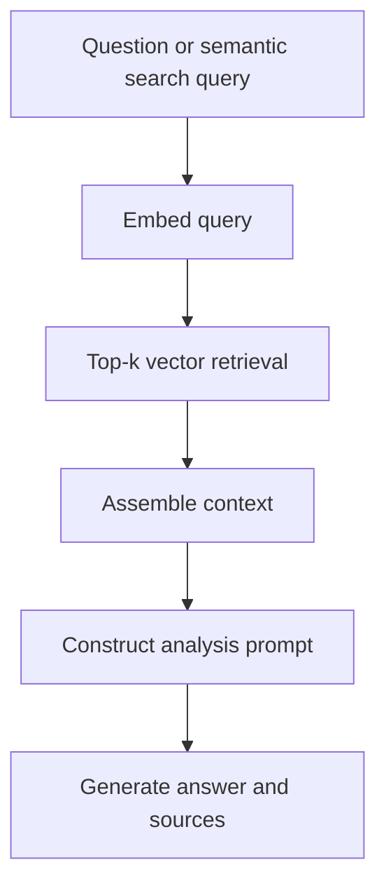

# AI Resume Analyzer

Production-grade resume intelligence platform demonstrating modern software engineering, data engineering, AI engineering, and DevOps practices.

Users upload resumes and job descriptions. The system extracts text from PDF/DOCX files, runs ETL, stores structured candidate data, chunks resumes, creates embeddings, performs RAG retrieval, analyzes candidate-job fit, generates feedback, supports semantic search, and exposes dashboards for users and admins.

## Architecture



## ETL Flow



## RAG Flow



## Folder Structure

```text
backend/      FastAPI app, SQLAlchemy models, Alembic migrations, services, Celery tasks, tests
frontend/     Next.js 15 TypeScript dashboard with Tailwind UI and charts
infra/        Terraform baseline for AWS deployment
docker/       Prometheus configuration and local operational assets
.github/      CI/CD workflows
docs/         API, deployment, and checkpoint documentation
```

## Database Schema

Core tables:

- `users`: account identity, password hash, role, active status.
- `resumes`: uploaded file metadata, raw text, parsed candidate fields, full-text search vector.
- `jobs`: job descriptions and extracted required skills.
- `resume_chunks`: chunked resume text with token counts.
- `embeddings`: vector rows for chunks using pgvector.
- `analysis_results`: ATS score, skill score, experience score, gaps, strengths, weaknesses, recommendations, roadmap, certifications, projects.

Indexes:

- Unique user email index.
- GIN full-text index on `resumes.search_vector`.
- HNSW vector index on `embeddings.vector`.

## API

FastAPI automatically generates OpenAPI docs:

- Local Swagger UI: `http://localhost:8000/docs`
- OpenAPI JSON: `http://localhost:8000/api/v1/openapi.json`

Main endpoint groups:

- `/auth`: registration, login, current user.
- `/upload`: resume upload, resume listing, job description upload.
- `/analyze`: ATS and candidate-job fit analysis.
- `/chat`: RAG-backed resume Q&A.
- `/search`: semantic search over candidate chunks.
- `/dashboard`: user and admin analytics.

See [docs/api.md](docs/api.md).

## Local Development

1. Copy environment values:

```bash
cp .env.example .env
```

2. Start the full stack:

```bash
docker compose up --build
```

3. Run migrations:

```bash
docker compose exec backend alembic upgrade head
```

4. Open services:

- Frontend: `http://localhost:3000`
- Backend: `http://localhost:8000`
- API docs: `http://localhost:8000/docs`
- Prometheus: `http://localhost:9090`
- Grafana: `http://localhost:3001`

## Backend Development

```bash
cd backend
python -m venv .venv
source .venv/bin/activate
pip install ".[dev]"
ruff check app tests
pytest
bandit -r app
```

## Frontend Development

```bash
cd frontend
npm install
npm run dev
npm test
npm run test:e2e
```

## Security

Implemented:

- JWT auth and protected routes.
- Bcrypt password hashing.
- Role-based admin/user access.
- Pydantic validation.
- SQLAlchemy query construction.
- CORS configuration.
- Rate-limit configuration hook.
- Bandit and Trivy in CI.
- Secrets loaded from environment variables.

Recommended production additions:

- Managed WAF or gateway rate limiting.
- S3-compatible private object storage for uploaded resumes.
- Virus scanning for uploads.
- Dedicated secret manager.

## Observability

Implemented:

- Structured JSON logs with `structlog`.
- OpenTelemetry FastAPI instrumentation.
- Prometheus `/metrics` endpoint.
- Docker Compose Prometheus and Grafana services.

Tracked metrics include request counts and latency. The architecture includes extension points for embedding latency, retrieval latency, LLM latency, and error-rate dashboards.

## Deployment

Primary target:

- Frontend: Vercel.
- Backend: Railway or Render.
- Database: Neon PostgreSQL with pgvector.
- Redis: Upstash.
- Vector DB: Qdrant Cloud or pgvector.

AWS option:

- ECS Fargate.
- RDS PostgreSQL.
- ElastiCache Redis.
- S3 resume storage.
- CloudWatch logs and metrics.
- Terraform baseline in `infra/terraform`.

See [docs/deployment.md](docs/deployment.md).

## Checkpoint Plan

The required incremental delivery plan is documented in [docs/checkpoints.md](docs/checkpoints.md). Each checkpoint includes:

- Feature branch name.
- Commit message.
- Pull request title.
- Pull request description template.
- Testing checklist.

## Current Implementation Notes

The local embedding provider is deterministic and dependency-light so local tests do not need external AI services. Production can swap in OpenAI, BGE, SentenceTransformers, Qdrant Cloud, or pgvector through the service abstractions.
