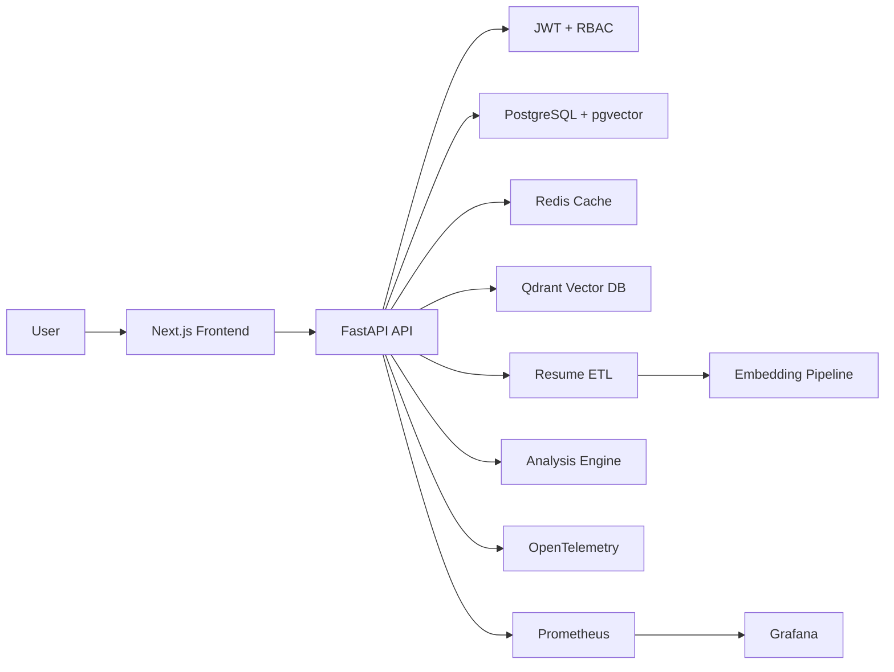
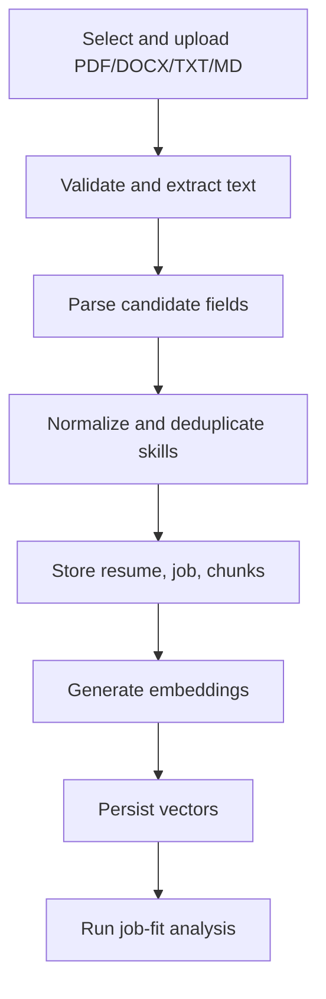
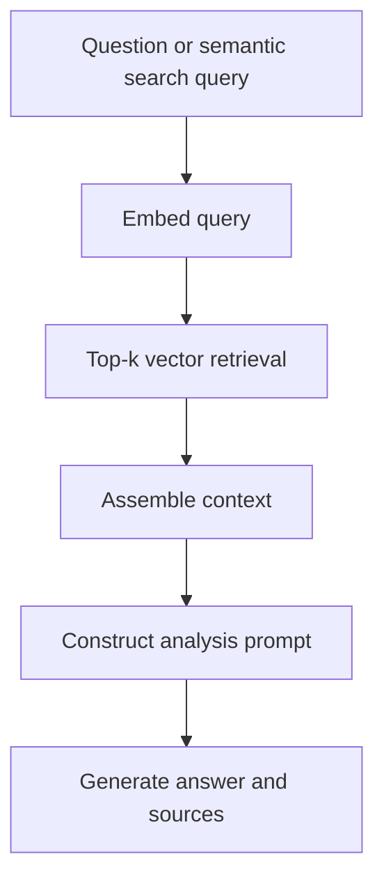

# Am i a good match?

Resume and job-match intelligence platform demonstrating modern software engineering,
data engineering, AI engineering, and DevOps practices.

Users register, sign in, or use the demo account, then upload a resume and paste a
job description. The system extracts text from PDF/DOCX/TXT/MD files, runs ETL,
stores structured resume data, chunks resume content, creates embeddings, analyzes
candidate-job fit, and returns practical guidance: ATS score, skill match,
experience match, missing skills, weaknesses, strengths, next steps,
certifications, and portfolio project ideas.

The live deployment is designed for:

- Frontend: Netlify.
- Backend API: Render.
- Database: Neon PostgreSQL with pgvector.
- Redis: Upstash.
- Optional vector search: Qdrant or pgvector.

## User Flow

1. Create an account, sign in, or use the demo login.
2. Select a resume file.
3. Click `Upload Resume` to parse and store the resume.
4. Paste a target job description.
5. Click `Analyze Match`.
6. Review scores and targeted feedback generated from the uploaded resume and job description.

Resume upload is intentionally a two-step interaction. Choosing a file does not
immediately upload it; users can confirm the selected file first. The backend
rejects empty, unreadable, oversized, scanned/no-text, or extremely thin files
with clear validation messages.

## Scoring Model

The analyzer returns three main scores:

- `ATS Score`: weighted overall score built from skill alignment, experience evidence, and resume/ATS quality.
- `Skill Match`: required skill and job-keyword coverage between the job description and resume.
- `Experience Match`: practical evidence score based on years fit, projects,
  work experience, seniority signals, measurable outcomes, and role relevance.

The current ATS score weighting is:

- 40% skill and keyword alignment.
- 35% experience evidence and role readiness.
- 25% ATS/readability quality.

The scoring engine rewards structured evidence, not keyword stuffing. It looks
for standard sections, contact/name parsing, role-matched skills, project/work
evidence, required years, measurable impact, readable resume length, and
quantified outcomes such as percentages, users, cost, latency, uptime, revenue,
or throughput.

## Architecture



## ETL Flow



## RAG Flow



## Folder Structure

```text
backend/      FastAPI app, SQLAlchemy models, Alembic migrations, services, Celery tasks, tests
frontend/     Next.js TypeScript dashboard with Tailwind UI
infra/        Terraform baseline for AWS deployment
docker/       Prometheus configuration and local operational assets
.github/      CI/CD workflows
docs/         API, deployment, and checkpoint documentation
```

## Database Schema

Core tables:

- `users`: account identity, password hash, role, active status.
- `resumes`: uploaded file metadata, raw text, parsed candidate fields, full-text search vector.
- `jobs`: job descriptions and extracted required skills.
- `resume_chunks`: chunked resume text with token counts.
- `embeddings`: vector rows for chunks using pgvector.
- `analysis_results`: ATS score, skill score, experience score, gaps, strengths,
  weaknesses, recommendations, roadmap, certifications, and portfolio projects.

Indexes:

- Unique user email index.
- GIN full-text index on `resumes.search_vector`.
- HNSW vector index on `embeddings.vector`.

## API

FastAPI automatically generates OpenAPI docs:

- Local Swagger UI: `http://localhost:8000/docs`
- OpenAPI JSON: `http://localhost:8000/api/v1/openapi.json`

Main endpoint groups:

- `/auth`: registration, login, current user.
- `/upload`: resume upload, resume listing, job description upload.
- `/analyze`: ATS and candidate-job fit analysis.
- `/chat`: RAG-backed resume Q&A.
- `/search`: semantic search over candidate chunks.
- `/dashboard`: usage and score summary endpoints.

See [docs/api.md](docs/api.md).

## Local Development

1. Copy environment values:

```bash
cp .env.example .env
```

2. Start the full stack:

```bash
docker compose up --build
```

3. Run migrations:

```bash
docker compose exec backend alembic upgrade head
```

4. Open services:

- Frontend: `http://localhost:3000`
- Backend: `http://localhost:8000`
- API docs: `http://localhost:8000/docs`
- Prometheus: `http://localhost:9090`
- Grafana: `http://localhost:3001`

## Backend Development

```bash
cd backend
python -m venv .venv
source .venv/bin/activate
pip install ".[dev]"
ruff check app tests
pytest
bandit -r app
```

## Frontend Development

```bash
cd frontend
npm install
npm run dev
npm test
npm run test:e2e
```

## Security

Implemented:

- JWT auth and protected routes.
- Bcrypt password hashing.
- Role-based admin/user access.
- Pydantic validation.
- SQLAlchemy query construction.
- CORS configuration.
- Rate-limit configuration hook.
- Bandit and Trivy in CI.
- Secrets loaded from environment variables.

Recommended production additions:

- Managed WAF or gateway rate limiting.
- S3-compatible private object storage for uploaded resumes.
- Virus scanning for uploads.
- Dedicated secret manager.

## Observability

Implemented:

- Structured JSON logs with `structlog`.
- OpenTelemetry FastAPI instrumentation.
- Prometheus `/metrics` endpoint.
- Docker Compose Prometheus and Grafana services.

Tracked metrics include request counts and latency. The architecture includes
extension points for embedding latency, retrieval latency, LLM latency, and
error-rate dashboards.

## Deployment

Primary target used by this project:

- Frontend: Netlify.
- Backend: Render.
- Database: Neon PostgreSQL with pgvector.
- Redis: Upstash.
- Vector DB: Qdrant Cloud or pgvector.

Required frontend environment:

```text
NEXT_PUBLIC_API_URL=/api/v1
BACKEND_URL=https://your-render-api.onrender.com
```

Required backend environment:

```text
DATABASE_URL=postgresql://...
REDIS_URL=rediss://...
JWT_SECRET=use-a-long-random-secret
CORS_ORIGINS=https://your-netlify-site.netlify.app
EMBEDDING_PROVIDER=local
LLM_PROVIDER=local
```

Current live project URLs:

- Frontend: `https://famous-donut-12beec.netlify.app`
- Backend health: `https://am-i-a-good-match-api.onrender.com/health`

AWS option:

- ECS Fargate.
- RDS PostgreSQL.
- ElastiCache Redis.
- S3 resume storage.
- CloudWatch logs and metrics.
- Terraform baseline in `infra/terraform`.

See [docs/deployment.md](docs/deployment.md).

## Checkpoint Plan

The required incremental delivery plan is documented in
[docs/checkpoints.md](docs/checkpoints.md). Each checkpoint includes:

- Feature branch name.
- Commit message.
- Pull request title.
- Pull request description template.
- Testing checklist.

## Current Implementation Notes

The local embedding provider is deterministic and dependency-light so local tests
do not need external AI services. Production can swap in OpenAI, BGE,
SentenceTransformers, Qdrant Cloud, or pgvector through the service abstractions.

The frontend currently focuses on the core user journey: authentication, demo
login, resume upload, job description entry, scoring, and recommendations.
Search, admin analytics, and trend dashboards are present as backend architecture
extension points but are intentionally not the primary UI flow.

## Resume Project Summary

`Am i a good match?` is a full-stack AI resume analyzer that compares uploaded
resumes against target job descriptions, extracting resume text, parsing candidate
signals, generating embeddings, and producing ATS, skill-match, and
experience-match scores.

Built and deployed a production-style platform with FastAPI, Next.js,
PostgreSQL/pgvector, Redis, Docker, CI/CD, Netlify, Render, Neon, and Upstash,
including JWT auth, ETL, RAG-ready chunking, observability hooks, and
recruiter-focused recommendations.

## Skills Demonstrated

- Software Engineering: FastAPI, Next.js, TypeScript, Python, REST APIs, clean
  architecture, service layer, repository pattern, dependency injection.
- Data Engineering: ETL pipelines, PDF/DOCX text extraction, parsing,
  normalization, deduplication, PostgreSQL schema design, full-text search,
  structured candidate data.
- AI Engineering: embeddings, resume chunking, RAG pipeline design, semantic
  search, prompt/context assembly, deterministic local embedding provider,
  AI scoring engine.
- Backend: SQLAlchemy, Alembic migrations, async API design, Pydantic validation,
  JWT authentication, password hashing, role-based access foundations.
- Frontend: React, Tailwind CSS, responsive dashboard UI, file upload workflow,
  auth flows, interactive analysis reports.
- DevOps: Docker, Docker Compose, GitHub Actions, CI checks, Bandit, Trivy,
  Netlify deployment, Render deployment, environment-based configuration.
- Cloud/Infrastructure: Neon PostgreSQL, Upstash Redis, Qdrant-ready vector
  storage, Terraform baseline, AWS ECS/RDS/ElastiCache/S3 deployment design.
- Observability: structured logging, OpenTelemetry instrumentation, Prometheus
  metrics endpoint, Grafana dashboard setup.
- Product: ATS scoring, skill-gap analysis, experience-gap detection,
  recommendation engine, demo account flow, production deployment documentation.
