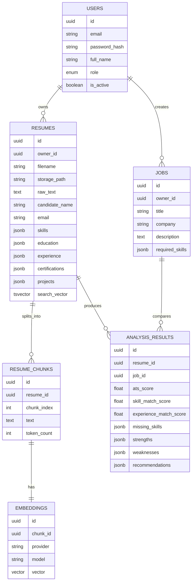

# Database Schema

```mermaid
erDiagram
  USERS ||--o{ RESUMES : owns
  USERS ||--o{ JOBS : creates
  RESUMES ||--o{ RESUME_CHUNKS : splits_into
  RESUME_CHUNKS ||--|| EMBEDDINGS : has
  RESUMES ||--o{ ANALYSIS_RESULTS : produces
  JOBS ||--o{ ANALYSIS_RESULTS : compares

  USERS {
    uuid id
    string email
    string password_hash
    string full_name
    enum role
    boolean is_active
  }

  RESUMES {
    uuid id
    uuid owner_id
    string filename
    string storage_path
    text raw_text
    string candidate_name
    string email
    jsonb skills
    jsonb education
    jsonb experience
    jsonb certifications
    jsonb projects
    tsvector search_vector
  }

  JOBS {
    uuid id
    uuid owner_id
    string title
    string company
    text description
    jsonb required_skills
  }

  RESUME_CHUNKS {
    uuid id
    uuid resume_id
    int chunk_index
    text text
    int token_count
  }

  EMBEDDINGS {
    uuid id
    uuid chunk_id
    string provider
    string model
    vector vector
  }

  ANALYSIS_RESULTS {
    uuid id
    uuid resume_id
    uuid job_id
    float ats_score
    float skill_match_score
    float experience_match_score
    jsonb missing_skills
    jsonb strengths
    jsonb weaknesses
    jsonb recommendations
  }
```
